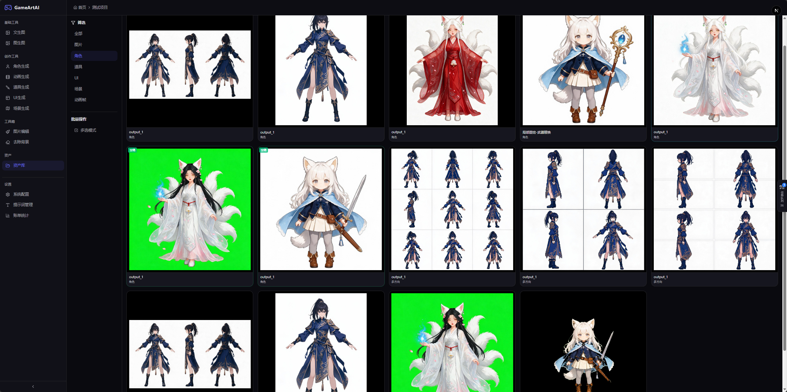
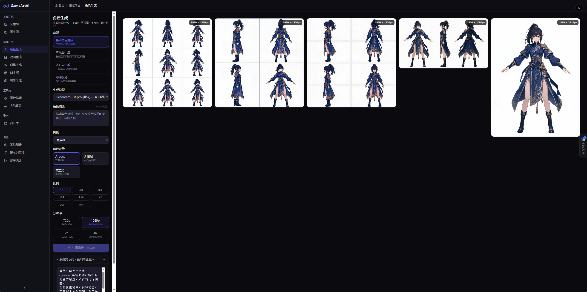
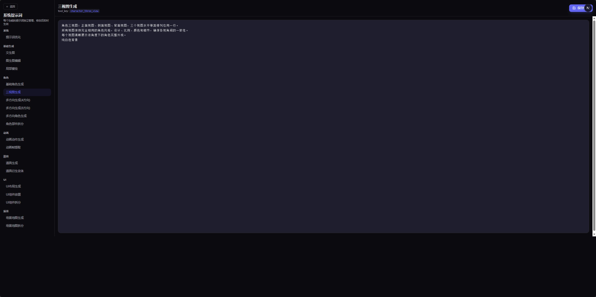

# GameArt AI

AI 游戏美术资产生成平台 — 面向独立游戏开发者和游戏美术设计师的高效创作工具。

> **注意：** 本项目为个人业余时间开发的试验品，诸多功能尚未完善，Bug 较多。仅供学习研究，自行探索使用，不提供技术支持和维护承诺。项目代码绝大部分由 AI 辅助生成。
> 后续功能思路，动画生成调用seedance模型生成视频，提前帧，用户选择需要的帧保留，输出为sprite sheet或者视频文件。场景和ui还在构思

## 核心功能

| 功能模块 | 说明 |
|---------|------|
| 文生图 | 根据提示词生成游戏美术图片，支持 LLM 提示词增强 |
| 图生图 | 基于参考图 + 提示词生成新图片 |
| 局部重绘 | 遮罩区域局部修改，不影响其他区域 |
| 图片编辑 | 基于参考图的编辑模式 |
| 去除背景 | 调用火山引擎 MediaKit API，智能移除图片背景，输出透明 PNG |
| 角色生成 | T 姿势角色、多方向视图角色生成 |
| 场景生成 | 游戏场景图生成 |
| 道具生成 | 武器、道具等游戏资产生成 |
| UI 生成 | 游戏 UI 界面生成 |
| 动画生成 | 动画帧序列生成 |
| 项目管理 | 项目创建、编辑、资产库管理、收藏、下载 |
| 系统配置 | 模型配置（文本/图片/工具）、对象存储配置、系统提示词管理 |
| 账单统计 | 生成记录、费用统计 |

## 技术栈

### 前端

| 技术 | 说明 |
|------|------|
| Next.js 16 | React 全栈框架，App Router |
| React 19 | UI 库 |
| TypeScript 5 | 类型安全 |
| shadcn/ui | 基于 Radix UI 的组件库 |
| Tailwind CSS 4 | 原子化 CSS |
| pnpm | 包管理器 |

### 后端

| 技术 | 说明 |
|------|------|
| Python 3.12+ | 运行时 |
| FastAPI | Web 框架（端口 8000） |
| asyncpg | PostgreSQL 异步驱动 |
| LangChain | LLM 调用（langchain-openai） |
| httpx | HTTP 客户端（调用图片模型 API） |
| Pillow | 图像处理 |
| uv | 包管理器 |

### 基础设施

| 技术 | 说明 |
|------|------|
| PostgreSQL 16 | 数据库 |
| 火山引擎 Seedream | 图片生成模型 |
| 火山引擎 MediaKit | 图片背景移除 API |
| 火山引擎 TOS | 对象存储 |
| DeepSeek / OpenAI | 文本模型（提示词增强） |

## 目录结构

```
.
├── front/                     # Next.js 前端
│   ├── src/
│   │   ├── app/               # 页面路由
│   │   ├── components/        # UI 组件
│   │   ├── hooks/             # React hooks
│   │   └── lib/               # API 客户端、类型定义、工具函数
│   ├── public/                # 静态资源
│   ├── package.json
│   └── next.config.ts
│
├── backend/                   # Python FastAPI 后端
│   ├── main.py                # FastAPI 入口
│   ├── config.py              # 配置（从 .env 读取）
│   ├── database.py            # asyncpg 数据库连接
│   ├── seed_data.py           # 系统提示词初始化
│   ├── routers/               # API 路由
│   └── services/              # 业务服务
│
├── docs/                      # 项目文档
│   └── development-guide.md   # 开发指南
├── assets/                    # 项目静态资源
├── DESIGN.md                  # 设计规范
├── AGENTS.md                  # AI Agent 上下文
└── .gitignore
```

## 界面预览







## 快速开始

### 环境要求

- **Node.js** >= 18
- **pnpm** >= 9
- **Python** >= 3.12
- **uv** (Python 包管理器)
- **PostgreSQL** 16

### 后端启动

```bash
cd backend
cp .env.example .env   # 编辑数据库等配置
uv sync
uv run python main.py  # 端口 8000
```

### 前端启动

```bash
cd front
cp .env.example .env   # 编辑后端 API 地址
pnpm install
pnpm dev               # 端口 3000
```

## Docker 部署

使用 Docker Compose 一键启动全部服务（前端 + 后端 + PostgreSQL）。

### 环境要求

- **Docker** >= 20.10
- **Docker Compose** >= 2.0

### 快速启动

```bash
# 1. 准备环境变量（可选，有默认值）
cp .env.docker.example .env.docker

# 2. 构建并启动所有服务
docker compose --env-file .env.docker up -d --build

# 3. 查看服务状态
docker compose ps

# 4. 查看日志
docker compose logs -f
```

启动后访问：
- **前端**: http://localhost:3000
- **后端 API 文档**: http://localhost:8000/docs
- **健康检查**: http://localhost:8000/api/health

### 服务架构

| 服务 | 镜像/构建 | 端口 | 说明 |
|------|----------|------|------|
| `postgres` | `postgres:16-alpine` | 5432 | PostgreSQL 数据库，数据卷持久化 |
| `backend` | `backend/Dockerfile` | 8000 | Python FastAPI，uv 包管理 |
| `frontend` | `front/Dockerfile` | 3000 | Next.js standalone 生产构建 |

### 常用命令

```bash
# 停止服务
docker compose down

# 停止并清除数据卷（重置数据库）
docker compose down -v

# 重新构建并启动
docker compose up -d --build

# 仅重启某个服务
docker compose restart backend
```

### 环境变量

Docker 部署通过 `.env.docker` 文件或环境变量配置，详见 [.env.docker.example](./.env.docker.example)。

### 数据持久化

- `postgres_data` 卷：PostgreSQL 数据库文件
- `uploads_data` 卷：后端生成/上传的图片文件

## 环境变量

### 后端 (`backend/.env`)

```
DB_HOST=127.0.0.1
DB_PORT=5432
DB_USER=gameart
DB_PASSWORD=gameart123
DB_NAME=game_art_ai
UPLOAD_DIR=./uploads
MAX_UPLOAD_SIZE=10485760
BACKEND_PORT=8000
CORS_ORIGINS=http://localhost:3000,http://localhost:5000
```

### 前端 (`front/.env`)

```
NEXT_PUBLIC_API_URL=http://localhost:8000
```

## 核心架构

### 前后端通信

- 前端通过 `NEXT_PUBLIC_API_URL` 环境变量指定后端地址
- 前端 API 客户端统一调用后端
- 图片 URL 通过 `resolveImageUrl()` 解析后端返回的相对路径

### 提示词管线

```
用户输入 → 加载系统提示词（DB） → LangChain LLM 增强 → 图片模型生成 → 绿幕移除后处理 → 返回透明 PNG
```

## 文档
- [docs/development-guide.md](./docs/development-guide.md) — 完整开发指南（架构、数据库、API、组件、业务流程）

## License

[MIT](LICENSE)

Copyright (c) 2025 GameArt AI

Permission is hereby granted, free of charge, to any person obtaining a copy
of this software and associated documentation files (the "Software"), to deal
in the Software without restriction, including without limitation the rights
to use, copy, modify, merge, publish, distribute, sublicense, and/or sell
copies of the Software, and to permit persons to whom the Software is
furnished to do so, subject to the following conditions:

The above copyright notice and this permission notice shall be included in all
copies or substantial portions of the Software.

THE SOFTWARE IS PROVIDED "AS IS", WITHOUT WARRANTY OF ANY KIND, EXPRESS OR
IMPLIED, INCLUDING BUT NOT LIMITED TO THE WARRANTIES OF MERCHANTABILITY,
FITNESS FOR A PARTICULAR PURPOSE AND NONINFRINGEMENT. IN NO EVENT SHALL THE
AUTHORS OR COPYRIGHT HOLDERS BE LIABLE FOR ANY CLAIM, DAMAGES OR OTHER
LIABILITY, WHETHER IN AN ACTION OF CONTRACT, TORT OR OTHERWISE, ARISING FROM,
OUT OF OR IN CONNECTION WITH THE SOFTWARE OR THE USE OR OTHER DEALINGS IN THE
SOFTWARE.
